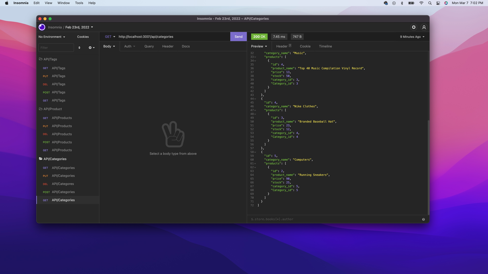

# ORM-E-COMMERCE-BACK-END
 

  ## Description: 
  This is the backend for an e-commerce website, utilizing express.js, api, sequelize and mySQL to make this a functioning website. 
  ## Table of Contents:
  -- [Usage](#usage)

  -- [Installation](#installation)

  -- [License](#license)

  -- [Contributors](#contributors)

  -- [Github User Name](#Github-User-Name)

  -- [Email](#email)

  -- [Test](#test)
  
  ## Usage:
  Here is a link to a [demo](https://vimeo.com/685671939/e2c9aacb7d) 
  
  
  ## Installation:
  Once you have the repo code downloaded you can open up VS code and create the database in Workbench with the schema provided. Once you can see that the database is there you need to create tables so that you can seed the data that is given. Now run the code: npm i, to install the packages that were used in this project. Then we will run the code node seeds/index.js to seed the database so we can manipulate the data provided. Now in the integrated terminal in VS code we can start up the server so I will run the code: nodemon server.js or you can run the code node server.js, now you can work in insomnia where it can demonstrate the api routes. 
  ## License:
   [License: MIT](https://opensource.org/licenses/MIT)
  Permission is hereby granted, free of charge, to any person obtaining a copy of this software and associated documentation files (the "Software"), to deal in the Software without restriction, including without limitation the rights to use, copy, modify, merge, publish, distribute, sublicense, and/or sell copies of the Software, and to permit persons to whom the Software is furnished to do so, subject to the following conditions: The above copyright notice and this permission notice shall be included in all copies or substantial portions of the Software. THE SOFTWARE IS PROVIDED "AS IS", WITHOUT WARRANTY OF ANY KIND, EXPRESS OR IMPLIED, INCLUDING BUT NOT LIMITED TO THE WARRANTIES OF MERCHANTABILITY, FITNESS FOR A PARTICULAR PURPOSE AND NONINFRINGEMENT. IN NO EVENT SHALL THE AUTHORS OR COPYRIGHT HOLDERS BE LIABLE FOR ANY CLAIM, DAMAGES OR OTHER LIABILITY, WHETHER IN AN ACTION OF CONTRACT, TORT OR OTHERWISE, ARISING FROM, OUT OF OR IN CONNECTION WITH THE SOFTWARE OR THE USE OR OTHER DEALINGS IN THE SOFTWARE. 
  ## Contributors:
  Me. 
  ## Github User Name:
  Here is a link to my Github: https://github.com/GundamMosi10
  ## Email:
  If you have any questions or would like to get in contact with me you can email me at this address: cargile10@gmail.com
  ## Test: 
  There are no tests associated with this project. 

